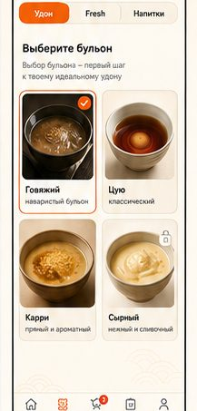
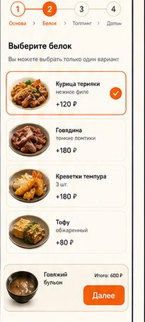
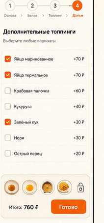

# 🍜 SANUKI UDON SHOP — бот + веб-приложение

Единый сервис: Telegram-бот и веб-приложение (Telegram Web App) работают
**в одном процессе и с одной базой данных**. Заказ, оформленный в браузере,
сразу виден в боте — и наоборот. **Статусы, названия этапов и история
изменений всегда одинаковы**, потому что их отдаёт один модуль
(`core/statuses.py`).

```
Telegram ──► aiogram-бот ─┐
                          ├──► core (заказы, статусы, оплата) ──► SQLite
Браузер ──► SPA ──► API ──┘            │
                                       └──► notify ──► уведомления в Telegram
```

---

## 🚀 Быстрый старт

```bash
pip install -r requirements.txt
cp .env.example .env      # заполнить три поля
python main.py            # http://localhost:8000
```

Откроется веб-приложение, рядом в том же процессе поднимется бот.

### Переменные окружения

Всё, что нужно ввести на хостинге:

| Переменная | Обязательно | Что это |
|---|---|---|
| `BOT_TOKEN` | ✅ | токен бота от @BotFather |
| `ADMIN_ID` | ✅ | Telegram ID администратора (можно несколько через запятую; принимается и `ADMIN_IDS`) |
| `YOOMONEY_API` | ✅ | токен ЮMoney — **пока используется заглушкой**, реальных списаний нет |

Остальное — опционально и имеет значения по умолчанию
(см. [`.env.example`](.env.example)): `WEBAPP_URL`, `PORT`, `DB_PATH`,
`WEBHOOK_URL`, `DEBUG`, `YOOMONEY_MODE`, `YOOMONEY_WALLET`, `YOOMONEY_SECRET`.

> Чтобы в боте появилась кнопка **«Открыть SANUKI»**, задайте `WEBAPP_URL`
> — публичный адрес приложения, например `https://sanuki.example.com`.
> Без него бот полностью работоспособен, просто без веб-кнопки.

### Docker

```bash
docker compose up -d --build
```

---

## 🧩 Что внутри

```
main.py            единая точка входа: FastAPI + бот в одном процессе
config.py          конфигурация из ENV (три обязательные переменные)
db.py              SQLite: пользователи, заказы, история статусов, стоп-лист

core/              общая логика (не знает ни про aiogram, ни про HTTP)
  statuses.py      статусы, их порядок, допустимые переходы
  menu.py          каталог из menu.json + сборка удона и расчёт цены
  orders.py        создание заказов, смена статусов, статистика
  payments.py      ЮMoney (заглушка + заготовка боевого режима)
  auth.py          проверка Telegram WebApp initData, сессии
  notify.py        шина событий (бот подписывается на неё)

bot/               Telegram-бот на aiogram 3
  handlers.py      регистрация, конструктор удона, заказы, админка
  keyboards.py     клавиатуры
  notifier.py      уведомления гостям и администраторам
  app.py           запуск polling / вебхука

api/               FastAPI
  routes.py        меню, авторизация, заказы, оплата, вызов сотрудника
  admin.py         админ-панель: заказы, статусы, статистика, стоп-лист
  server.py        сборка приложения и раздача SPA

webapp/            фронтенд без сборки (HTML + CSS + JS)
  index.html
  static/css/style.css
  static/js/{api,ui,app}.js
  static/img/*     графика, нарезанная из исходных макетов
```

---

## 📊 Статусы — одни и те же везде

| Код | Название | Эмодзи | Куда можно перейти |
|---|---|---|---|
| `new` | Новый | 🆕 | принят, готовится, отменён |
| `accepted` | Принят | ✅ | готовится, отменён |
| `cooking` | Готовится | 🔪 | готов, отменён |
| `ready` | Готов | 🍜 | в пути (только доставка), выдан, отменён |
| `on_the_way` | В пути | 🛵 | выдан, отменён |
| `completed` | Выдан | 🎉 | — |
| `cancelled` | Отменён | ❌ | — |

Эти же данные отдаёт `GET /api/statuses`, их же печатает бот. Смена статуса
в админке → гость получает push в Telegram; смена статуса кнопкой в боте →
в браузере статус обновится при следующем опросе (6 секунд).

---

## 🤖 Бот

| Команда | Что делает |
|---|---|
| `/start` | регистрация и главное меню |
| `/menu` | главное меню |
| `/orders` | мои заказы с текущими статусами |
| `/app` | открыть веб-приложение |
| `/admin` | активные заказы с кнопками смены статуса |
| `/stats` | статистика по заказам |

Сценарий заказа повторяет веб: **тип заказа → бульон → белок → топпинг →
допы → корзина → оплата → подтверждение**. Заказ, созданный в вебе,
прилетает администратору в бот с теми же кнопками статусов.

---

## 💳 Оплата (заглушка ЮMoney)

Сейчас `YOOMONEY_MODE=stub`:

* реальных списаний нет;
* веб открывает внутреннюю страницу «оплаты» с суммой;
* кнопка подтверждения меняет `payment_status` на `paid`, гость получает
  уведомление в Telegram, заказ движется по статусам как обычно;
* webhook `POST /api/payments/yoomoney/webhook` уже умеет проверять подпись
  (`sha1` + `YOOMONEY_SECRET`) и помечать заказ оплаченным.

Чтобы включить боевой режим позже:

```env
YOOMONEY_MODE=live
YOOMONEY_API=<токен>
YOOMONEY_WALLET=41001...
YOOMONEY_SECRET=<secret из настроек ЮMoney>
WEBAPP_URL=https://sanuki.example.com
```

---

## 🔌 API (кратко)

| Метод | Путь | Назначение |
|---|---|---|
| GET | `/api/menu` | каталог с учётом стоп-листа |
| GET | `/api/statuses` | статусы и их описания |
| POST | `/api/auth/telegram` | вход по `Telegram.WebApp.initData` |
| GET/POST | `/api/me` | профиль |
| POST | `/api/orders` | создать заказ (цены считает сервер) |
| GET | `/api/orders`, `/api/orders/{code}` | список и детали заказа с историей |
| POST | `/api/orders/{code}/cancel` | отмена |
| POST | `/api/orders/{code}/pay` | создание платежа |
| POST | `/api/payments/stub/{code}` | подтверждение оплаты (заглушка) |
| GET/POST/DELETE | `/api/admin/stop-list` | стоп-лист |
| GET | `/api/admin/stats` | статистика |
| POST | `/api/admin/orders/{id}/status` | смена статуса |

Документация: `/api/docs`.

---

## 🎨 Оформление

Стиль и графика взяты из приложенных макетов бренда: оранжевый
`#F76D10 / #FD6001`, кремовый фон `#FDF9F1`, тёмный текст `#15130F`,
скруглённые карточки, нижняя навигация и «история статусов» таймлайном.
Исходные макеты и нарезка экранов лежат в [`docs/`](docs).

| | |
|---|---|
|  |  |
|  |  |

---

## ⚠️ Про безопасность

Раньше в репозитории лежал файл `.env` с боевым токеном бота. Он удалён из
git и добавлен в `.gitignore`, но **токен остался в истории коммитов** —
его стоит перевыпустить в @BotFather (`/revoke`), чтобы им никто не смог
воспользоваться.
